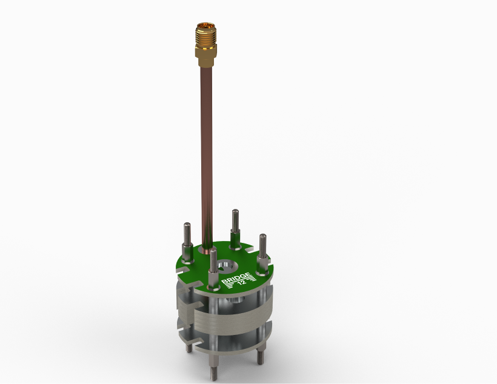

# OpenPCBLGR
An Open-Source Loop-Gap Resonator for X-Band EPR Spectroscopy

Rev 1.0

This repository contains CAD files (solidworks and STEP files), 3d printer files (STL), KiCAD project files, 
PCB gerber files, bill of materials (BOM), and the assembly manual.

The assembly manual for Rev1.0 is found in Manual/PCB LGR Assembly Instructions Rev1.0.docx

If no modifications to the resonator are required, the gerber files can be uploaded directly to the manufacturer's website.

 

